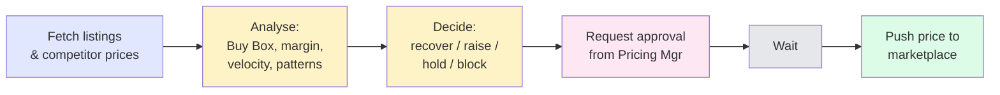
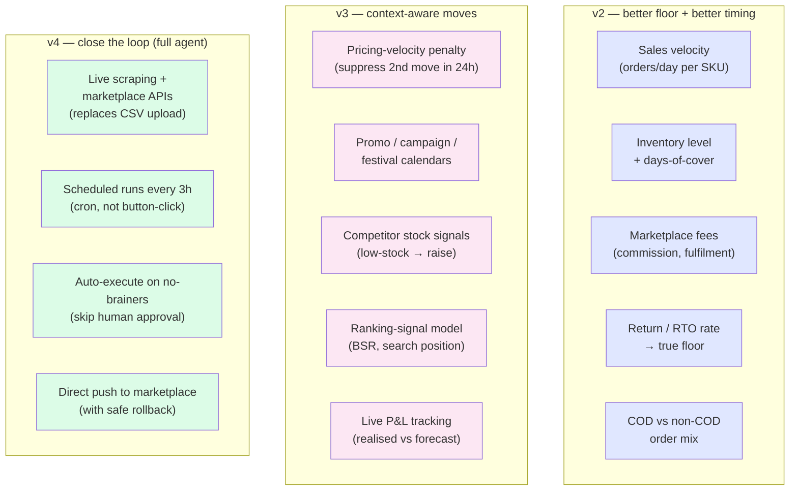

# Opptra Pricing Copilot — PRD

**Owner:** Atharv Kulkarni · **Stage:** Working prototype (case study) · **Last updated:** 2026-05-23

---

## 1. Problem

The Category Operations lead at Opptra (Ranjit, in our brief) runs the same loop every morning across 100+ SKUs × 3 marketplaces:

The **analyse → decide → request → wait** middle (yellow + pink) is ~50% of his day and is where bad decisions get made under time pressure. Today it lives in spreadsheets and Slack DMs. **v1 automates this middle; v4 eats the green endpoints too** (scraping replaces the manual fetch, auto-push handles the no-brainer cases).

## 2. What we built (v1 — this prototype)

A web app that automates the middle of that loop, leaving the human in charge at both ends (fetch and final push).

```mermaid
flowchart LR
    CSV["CSV / XLSX<br/>upload"] --> ING["Ingest +<br/>group by (sku,mp)"]
    ING --> ENG["Deterministic engine<br/>(GUT_RULES + patterns)"]
    ENG --> AI["GPT-5-mini<br/>(grounded in engine)"]
    AI --> UI["Triage UI<br/>+ Send for approval"]
    UI --> APR["Approver inbox<br/>(in-app)"]
    APR --> APP["Mark applied<br/>(would push to MP)"]
    APP --> AUD["Audit trail"]

    style ENG fill:#e0e7ff
    style AI fill:#fce7f3
    style UI fill:#dcfce7
    style AUD fill:#fef3c7
```

**Key guarantees the engine enforces (not the LLM):**
- Never recommends below `margin_floor + cushion` — hard server-side guard.
- Bucket = `recover` / `raise` / `hold` / `blocked` is computed by rules, not the LLM.
- Any positive headroom triggers a raise (no false-HOLD on small gaps — fixed in commit `8cad0b9`).
- AI only writes the sentence + manager's note + reasoning walkthrough, grounded in numbers the engine already chose.

**What the lead sees per row** (one card):
SKU + brand + marketplace, Buy Box status, current price → target price + delta + margin %, **FLOOR** chip (the bottom-most allowed price), confidence badge, AI recommendation sentence, expandable detail panel with competitor stack, decision walkthrough, expected impact (orders/day · profit/day forecast), and **Send for approval** in one click.

**CSV inputs accepted** (optional ones marked *):
`sku`, `brand`, `marketplace`, `our_price`, `competitor_price`, `buy_box`, `margin_floor`, `last_changed`, `name`\*, `category`\*, `listed_at`\*, `competitor_name`\* (multi-row for multi-competitor), `orders_in_period`\*, `period_days`\*, `profit_margin`\*.

**Surfaces shipped:** triage (`/`), import (`/import`) with explicit Submit step, audit trail (`/audit`), Approvals tab with snapshot context, persistent AI cache (no re-fetching on reload), append-only audit log.

## 3. What we deliberately did *not* build yet (but will — see v2/v4)

Direct marketplace push (always human-pushed for v1), live competitor scraping (CSV upload is the integration surface today), scheduled runs, auto-execute on safe moves, multi-user RBAC, mobile, real telemetry, A/B-tested pricing experiments.

---

## 4. Future roadmap (v2 → v4)

Each milestone adds a signal or autonomy lever to the same engine + AI flow above — no architecture rewrite needed. **v4 is what makes this a true agent, not a co-pilot.**

**v2 — make the floor reflect reality:**
- **Sales velocity** (orders/day) — already accepted in v1 schema (`orders_in_period` / `period_days`). v2 makes the engine *weight by it*: low-velocity SKUs get more cautious moves; high-velocity SKUs get tighter undercutting.
- **Inventory & days-of-cover** — *overstock* (>60 days of cover) → aggressively drop to clear; *low stock* (<7 days) → don't drop, even if Buy Box is lost, possibly raise. This is the biggest single profit unlock.
- **Marketplace fee model** — commission %, fulfilment fee, payment-gateway charge per marketplace. Today's `margin_floor` is a single number; v2 derives it from `(cogs + fees) × (1 + cushion)`.
- **Returns / RTO** — return rate × refund cost × RTO logistics. A 25% RTO category needs a higher floor than a 2% one.
- **COD vs non-COD mix** — COD orders carry higher RTO and payment overhead. Where the marketplace allows differential pricing, v2 suggests COD-specific floors.

**v3 — context the rules engine doesn't have today:**
- **Pricing-velocity penalty** — Amazon/Flipkart suppress Buy Box on multiple-moves-per-day. v3 hard-blocks a second auto-recommendation within 24h of an applied change unless margin delta exceeds a threshold.
- **Promo / campaign / festival calendars** — uploaded calendar (Diwali, Big Billion Days, brand pushes). The engine adjusts elasticity assumptions and pre-stages recommendations a week out.
- **Competitor stock signals** — when scraping shows a leading competitor at "Only 3 left" or out-of-stock, v3 recommends *raising* (their disappearance lifts our Buy Box odds at higher margin).
- **Ranking signals** — BSR, search-result rank, conversion rate per impression. Feeds the forecast model so "expected orders/day" is grounded in real ranking data instead of a fixed baseline.
- **Live P&L tracking** — close the loop. Every applied reprice is checked against its forecast 7/14/30 days later; deltas tune the rule weights automatically. Today's forecast is **modeled, not measured** (we label it as such in the UI); v3 makes it measured.

**v4 — close the loop, full agent:**
- **Live scraping + marketplace APIs** — replace the CSV upload with direct ingestion from Amazon SP-API, Flipkart Seller APIs, and headless scrapers for competitor pricing. CSV stays as a fallback for ad-hoc work.
- **Scheduled runs every ~3 hours** — `cron`-driven re-evaluation. The lead opens the app and sees a fresh queue, not stale data from this morning's manual refresh.
- **Auto-execute on no-brainer moves** — skip the human-in-the-loop entirely for low-risk, high-confidence raises. Concrete gate (tunable): `bucket == "raise"` AND `resulting_margin_pct > 25%` AND `move_size < 5%` AND `confidence == "High"` AND `no pricing-velocity violation` → auto-push, log to audit trail, notify the lead asynchronously. Anything outside this envelope still routes through approval as today.
- **Direct push to marketplace** — once auto-execute fires, the agent calls the marketplace API to update the price, with a rollback hook if conversion drops materially in the next 24h.

This turns Opptra from a co-pilot ("here's what to do") into an agent ("here's what I did, here's what I'm waiting on you for"). The lead's day collapses from 3–5 hrs of triage to ~30 min of exception review.

## 5. Success metrics (how we'll know each milestone worked)

| Metric | Today (manual) | v2 | v4 (full agent) |
|---|---|---|---|
| Time per SKU triaged | ~3–5 min | <30 sec | ~0 (only exceptions) |
| % of Buy Box recoveries acted on within 24h | ~40% | >85% | >98% |
| Margin sacrificed on missed raises | unknown | tracked, −30% | −60% |
| Repricing-velocity violations | not tracked | 0 (engine-blocked) | 0 |
| Approval cycle time | ~hours | <15 min median | 0 for no-brainers; <15 min otherwise |
| Lead hands-on time / day | 3–5 hrs | 1–2 hrs | ~30 min |

---

*Code: [github.com/ASK16-ai/opptra-assignment](https://github.com/ASK16-ai/opptra-assignment). Engine logic in `lib/heuristics.js`. AI prompt in `buildAiPrompt()`. Server-side floor guard in `pages/api/recommend.js`.*
